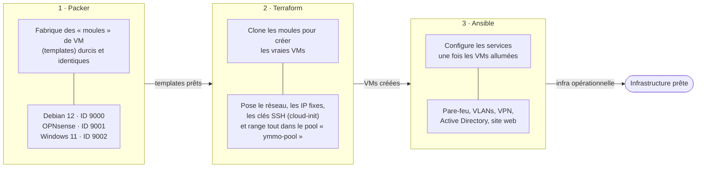
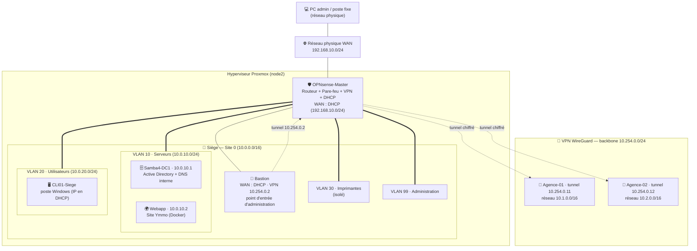
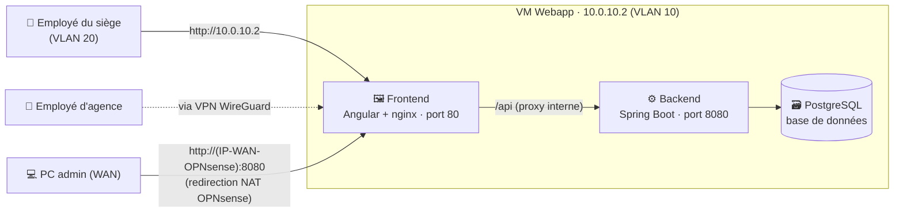

# Architecture de l'infrastructure Ymmo

> Ce document s'adresse à quelqu'un qui **découvre** l'infrastructure. Il explique,
> de haut en bas, **ce qui est déployé**, **comment c'est construit**, et **comment
> on accède au site web**. Les diagrammes sont en [Mermaid](https://mermaid.js.org)
> (rendu automatique sur GitHub / VS Code).

## 1. En une phrase

Ymmo est une infrastructure d'entreprise simulée sur **Proxmox** (un hyperviseur) :
un **siège social** et des **agences distantes**, reliés par un **VPN**, avec un
**annuaire Active Directory**, un **pare-feu/routeur**, et un **site web interne**.
Tout est créé automatiquement par du code (**Infrastructure as Code**), pas à la main.

## 2. Les 3 outils qui construisent tout (le pipeline)

L'infrastructure n'est jamais cliquée à la main : trois outils s'enchaînent, chacun
avec un rôle précis.

**Une seule commande enchaîne tout** : `./ymmo.sh full-deploy`.

## 3. Ce qui est déployé (topologie réseau)

Le cœur du réseau est le pare-feu **OPNsense** : il sépare l'extérieur (WAN) des
réseaux internes découpés en **VLANs** (des sous-réseaux étanches). Les machines
internes ne se parlent que si une **règle de pare-feu** l'autorise.

**À retenir :**
- **OPNsense** est au centre : tout passe par lui (routage, pare-feu, VPN, DHCP).
- Les **VLANs** isolent les usages (serveurs, utilisateurs, imprimantes, admin).
  Par défaut un VLAN ne parle pas aux autres — il faut une règle explicite.
- Le **Bastion** est la seule porte d'entrée pour administrer les machines internes :
  Ansible passe par lui (rebond SSH) via le tunnel WireGuard pour atteindre le VLAN 10.
- Les **agences** sont reliées au siège par des **tunnels VPN chiffrés** (WireGuard).

## 4. Le site web Ymmo et comment y accéder

Le site tourne sur la VM **Webapp** sous forme de 3 conteneurs Docker. L'utilisateur
ne voit qu'**un seul point d'entrée** (le frontend) ; celui-ci relaie les appels à
l'API en interne.

**Trois chemins d'accès :**
1. **Postes du siège (VLAN 20)** → directement `http://10.0.10.2` (autorisé par une règle de pare-feu).
2. **Postes d'agence** → même adresse, à travers le tunnel VPN.
3. **PC admin sur le réseau physique** → `http://<IP-WAN-OPNsense>:8080`, qu'OPNsense
   redirige (NAT/port-forward) vers la VM. *(L'IP WAN d'OPNsense est en DHCP : la
   relever via l'interface Proxmox ou l'agent QEMU.)*

## 5. Légende et plan d'adressage

### Machines (VMs)

| VM | Rôle | Adresse | Réseau |
|---|---|---|---|
| OPNsense-Master | Routeur / pare-feu / VPN / DHCP | WAN : DHCP + `.254` sur chaque VLAN | WAN + tous les VLANs |
| Bastion | Point d'entrée d'administration (rebond SSH) | WAN : DHCP / VPN `10.254.0.2` | WAN + VPN |
| Samba4-DC1 | Active Directory + DNS interne | `10.0.10.1` | VLAN 10 |
| Webapp | Site web Ymmo (Docker) | `10.0.10.2` | VLAN 10 |
| CLI01-Siege | Poste de test Windows | DHCP | VLAN 20 |
| Agence-01 / 02 | Endpoints VPN des sites distants | VPN `10.254.0.11` / `10.254.0.12` | WAN + VPN |

### Plan d'adressage : `10.[site].[vlan].[machine]`

| Réseau | Usage |
|---|---|
| `192.168.10.0/24` | Réseau physique (WAN) — hors infra |
| `10.0.10.0/24` | Siège · VLAN 10 — **Serveurs** (AD, site web) |
| `10.0.20.0/24` | Siège · VLAN 20 — **Utilisateurs** |
| `10.0.30.0/24` | Siège · VLAN 30 — **Imprimantes** (isolé) |
| `10.0.99.0/24` | Siège · VLAN 99 — **Administration** |
| `10.1.0.0/16` / `10.2.0.0/16` | Agences 01 / 02 |
| `10.254.0.0/24` | Backbone VPN WireGuard |

> La passerelle de chaque VLAN est toujours en `.254` (c'est OPNsense).

### Symboles des diagrammes

| Trait | Signification |
|---|---|
| `───` trait plein | lien réseau direct |
| `===` trait épais | interface VLAN sur OPNsense |
| `-.-` pointillés | tunnel VPN chiffré (WireGuard) |

---

*Pour le détail technique (choix d'outils, fichiers, commandes), voir
[`docs/plan.md`](plan.md) et le [`README`](../README.md).*
