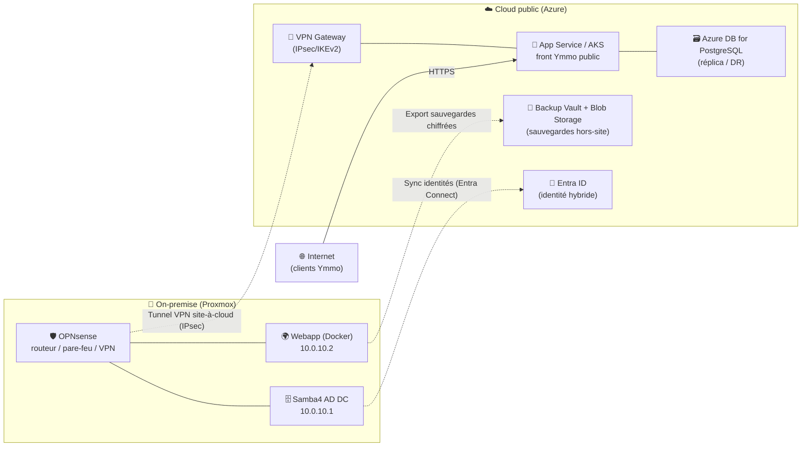

# Conception d'une extension Cloud hybride — Ymmo

> Document de **conception** (non déployé) : comment l'infrastructure Ymmo on-premise
> (Proxmox, siège + agences) serait étendue vers un cloud public en mode **hybride**.
> Provider de référence : **Microsoft Azure** (cohérent avec l'orientation AD/Windows) ;
> les équivalents **AWS** sont indiqués pour chaque brique.

---

## 1. Objectif et principe

Garder le cœur métier sensible **on-premise** (données clients, AD, réseau des agences)
et déporter dans le cloud ce qui profite de l'**élasticité**, de la **résilience** et
d'une **exposition publique maîtrisée**. C'est un modèle **hybride** : les deux mondes
sont reliés par un tunnel VPN chiffré et une identité commune.

**Ce qui reste on-premise**
- Contrôleur de domaine Samba4 (AD, DNS interne), postes utilisateurs, imprimantes.
- Routage/pare-feu OPNsense, VLANs, VPN inter-sites WireGuard.

**Ce qui part dans le cloud**
- Sauvegardes externalisées + Plan de Reprise d'Activité (PRA).
- Hébergement public et scalable du site web Ymmo.
- Supervision / journalisation centralisée.

---

## 2. Cas d'usage retenus

| # | Cas d'usage | Bénéfice | Priorité |
|---|---|---|---|
| 1 | **Sauvegarde externalisée + PRA** (BDD webapp, VMs critiques) | Résilience : règle 3-2-1, copie hors-site | Haute |
| 2 | **Hébergement hybride du site web** (front public dans le cloud) | Scalabilité, dispo, exposition propre (TLS, WAF) | Haute |
| 3 | **Identité hybride** (AD on-prem ↔ annuaire cloud) | SSO, MFA cloud, gestion centralisée | Moyenne |
| 4 | **Supervision centralisée** (logs/metrics → cloud) | Observabilité multi-sites | Basse |

---

## 3. Architecture cible (hybride)

---

## 4. Correspondance des briques (on-prem → cloud)

| Brique on-premise | Azure | AWS |
|---|---|---|
| Réseau / routage | Virtual Network (VNet) | VPC |
| VPN site-à-site (OPNsense) | **VPN Gateway** (IPsec/IKEv2) | **Site-to-Site VPN** (Virtual Private Gateway) |
| Active Directory (Samba4) | **Entra ID** + Entra Connect | AWS Directory Service / AD Connector |
| Site web (Docker Compose) | **App Service** (conteneur) ou **AKS** | Elastic Beanstalk / **ECS** / EKS |
| PostgreSQL | **Azure Database for PostgreSQL** | **RDS for PostgreSQL** |
| Sauvegardes | **Recovery Services Vault** + **Blob Storage** | **AWS Backup** + **S3 / Glacier** |
| Supervision | **Azure Monitor** / Log Analytics | **CloudWatch** |

---

## 5. Connectivité site-à-cloud

OPNsense gère déjà du VPN (WireGuard inter-sites). Pour le cloud, on monte un **tunnel
IPsec/IKEv2** entre OPNsense (côté WAN siège) et la **VPN Gateway** du cloud — IPsec est
le standard supporté par les passerelles managées (Azure/AWS) et nativement géré par
OPNsense. Le VNet/VPC cloud reçoit un plan d'adressage **hors des plages existantes**
(ex. `10.100.0.0/16`) pour éviter tout chevauchement avec `10.0.0.0/8` du siège/agences.

Résultat : les ressources cloud sont jointes au backbone privé Ymmo comme un « site »
supplémentaire, sans exposer l'infra interne sur Internet.

---

## 6. Identité hybride

L'AD on-premise (Samba4) reste **autoritaire**. Un connecteur de synchronisation
(**Entra Connect** côté Azure) réplique comptes et groupes vers l'annuaire cloud, ce qui
apporte **SSO** et **MFA** pour les services cloud (front Ymmo, portail admin) sans
dupliquer la gestion des utilisateurs.

> Nuance honnête : Entra Connect est officiellement validé pour Windows Server AD ; avec
> Samba4 le principe est identique (AD DS standard) mais à valider en POC. Alternative
> simple : fédération applicative via **OIDC/SAML** pour le seul site web.

---

## 7. Sauvegarde et PRA (le gain le plus concret)

- **BDD webapp** : `pg_dump` chiffré planifié → **Blob Storage** (versionné, immuable).
- **VMs critiques** (DC, webapp) : export `vzdump` Proxmox → stockage objet cloud.
- **Rétention** : règle **3-2-1** (3 copies, 2 supports, 1 hors-site = le cloud).
- **PRA** : en cas de sinistre du siège, le site web peut être **redéployé dans le cloud**
  (App Service + Azure DB restaurée depuis le dernier dump) → continuité de service.

---

## 8. Sécurité

- Tunnel **chiffré** (IPsec) ; aucune ressource interne exposée directement.
- Front public derrière **TLS** + éventuellement un **WAF** managé (Azure Front Door / AWS WAF).
- **Chiffrement au repos** des sauvegardes et de la base (clés gérées par le cloud).
- **IAM/RBAC** cloud : principe du moindre privilège, MFA pour les accès d'administration.
- Stockage de sauvegarde en **immuabilité** (anti-rançongiciel).

---

## 9. Modèle de coût (ordres de grandeur, à la demande)

| Poste | Modèle | Estimation indicative* |
|---|---|---|
| VPN Gateway | forfait horaire | ~25-35 €/mois |
| App Service (front) | plan B1/B2 | ~50-70 €/mois |
| Azure DB for PostgreSQL | vCore Burstable | ~30-50 €/mois |
| Blob Storage (sauvegardes) | au Go stocké | quelques €/mois |
| **Total démo** | pay-as-you-go | **~120-160 €/mois** |

\* Estimations à affiner avec le calculateur officiel (Azure Pricing Calculator / AWS
Pricing Calculator). Avantage clé : **pas d'investissement matériel**, on paie l'usage.

---

## 10. Phasage de mise en œuvre

1. **Connectivité** : VNet/VPC + tunnel IPsec OPNsense ↔ VPN Gateway.
2. **Sauvegarde/PRA** : externalisation des dumps BDD + VMs (gain immédiat, faible coût).
3. **Front hybride** : déploiement du site Ymmo en App Service + base managée.
4. **Identité** : synchronisation AD ↔ cloud, SSO/MFA.
5. **Supervision** : centralisation des logs/metrics.

> Approche **Infrastructure as Code** réutilisable : la même logique que le pipeline
> Packer/Terraform/Ansible existant s'applique au cloud (Terraform a des providers
> `azurerm` / `aws`), ce qui garde l'infra **reproductible et versionnée**.
