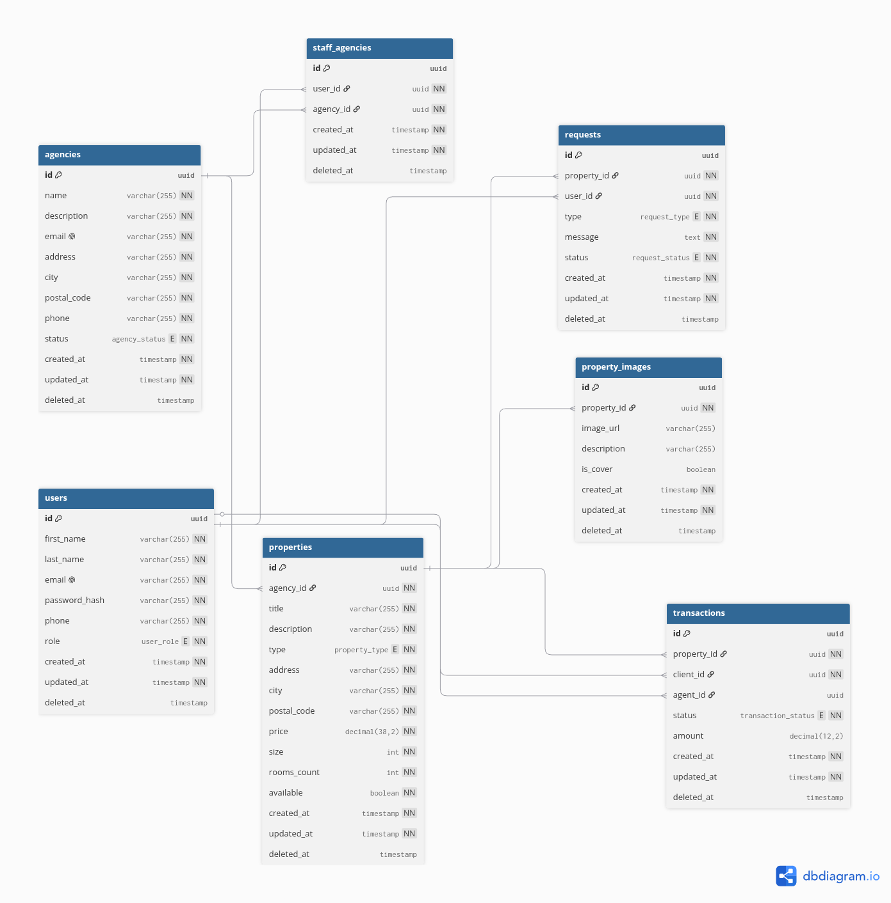

# Ymmo-Web

## Description

Ymmo-Web est le module applicatif de la plateforme Ymmo. Il couvre l'intégralité de la couche web : interface utilisateur, API métier et module d'intelligence artificielle. Il sert d'interface unique pour les clients et les agents immobiliers, et expose les données du marché via une API REST consommée par le frontend et le module IA.

## Stack Technique

| Composant       | Technologie          |
| --------------- | -------------------- |
| Frontend        | Angular (TypeScript) |
| Backend & API   | Spring Boot (Java)   |
| IA & Data       | Python               |
| Base de données | PostgreSQL           |

## Structure du projet

```
Ymmo-Web/
├── frontend/   # Application Angular (client)
├── backend/    # API Spring Boot (serveur)
├── ai/         # Module IA & Data (Python)
└── doc/        # Documentation technique (schéma BDD, etc.)
```

Chaque module possède son propre README avec les instructions d'installation et de configuration spécifiques :

- [frontend/README.md](frontend/README.md)
- [backend/README.md](backend/README.md)
- [ai/README.md](ai/README.md)

## Architecture

### Schéma de la Base de Données



Le schéma source (dbdiagram.io) est disponible dans [doc/dbdiagram.io](doc/dbdiagram.io).

### Architecture logicielle

```
Angular (frontend)
    ↕ HTTP / REST
Spring Boot (backend)  ←→  PostgreSQL
    ↕
Python (module IA)
```

Le backend expose une API REST documentée via Swagger, consommée par le frontend. Le module IA communique également avec le backend pour accéder aux données métier.

## Installation rapide

Chaque module se lance indépendamment. Se référer au README du module concerné pour les détails.

### Backend

```bash
cd backend
cp .env.example .env   # Renseigner les credentials PostgreSQL et JWT
docker compose -f dc-postgresql.yml up -d   # Lancer PostgreSQL
mvn clean install && mvn spring-boot:run
```

API disponible sur `http://localhost:8080/api`  
Swagger UI : `http://localhost:8080/api/swagger-ui/index.html`

### Frontend

```bash
cd frontend
npm install
ng serve
```

### IA & Data

Voir [ai/README.md](ai/README.md).

## Conventions de nommage

| Contexte      | Convention       |
| ------------- | ---------------- |
| Variables     | lowerCamelCase   |
| Fonctions     | lowerCamelCase   |
| Base de données | snake_case     |
| Python        | snake_case       |
| Commentaires  | Français         |

## Tests

<!-- Détailler ici la stratégie de tests globale (unitaires, intégration, e2e) -->

## Troubleshooting (Dépannage)

<!-- Documenter les problèmes connus et leurs solutions -->
